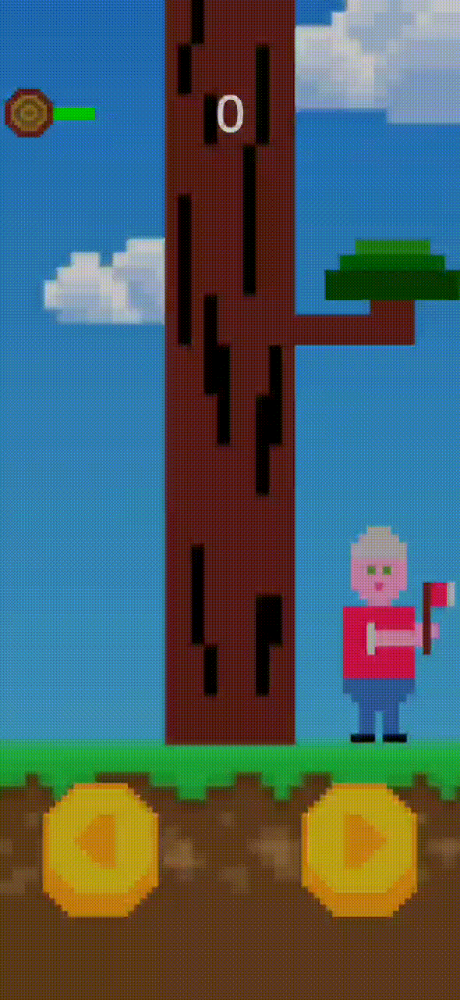

# cut-cut-cut
Mobile game, made with Unity, about a lumberjack cutting trees.

## Getting Started

### Prerequisites
Android is required to run the game.

### Installation
If you want to try it all you have to do is:

1. Download the cut-cut-cut.apk file (you find it in the dist folder of this project) on your mobile device
2. Click on the downloaded apk and follow the steps to install the game